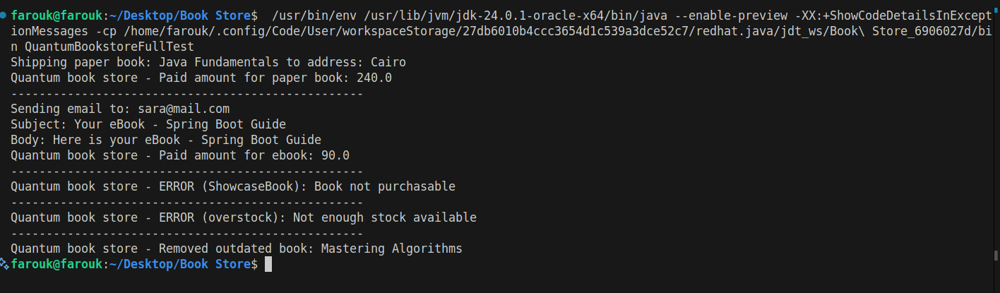

# 📚 Quantum Bookstore – Fawry Internship Challenge

Welcome to the **Quantum Bookstore** challenge submitted for the **Fawry N² Dev Slope #10** internship program.

This is a Java console-based simulation of an online bookstore, showcasing OOP design, error handling, extensibility, and service interaction.

---

## 🚀 Features

- Add different types of books:
  - `PaperBook`: Has stock and is shipped
  - `EBook`: Has file type and is emailed
  - `ShowcaseBook`: Display only, not for sale
- Buy books using ISBN
- Validate stock availability
- Send paper books to a `ShippingService`
- Send eBooks to a `MailService`
- Remove outdated books older than X years
- Print payment receipts and service logs

---

## 📸 Screenshot

> Output from running the full test:



---

## 🧪 How to Run

1. **Clone the repository**
   ```bash
   git clone https://github.com/your-username/quantum-bookstore.git
   cd quantum-bookstore
